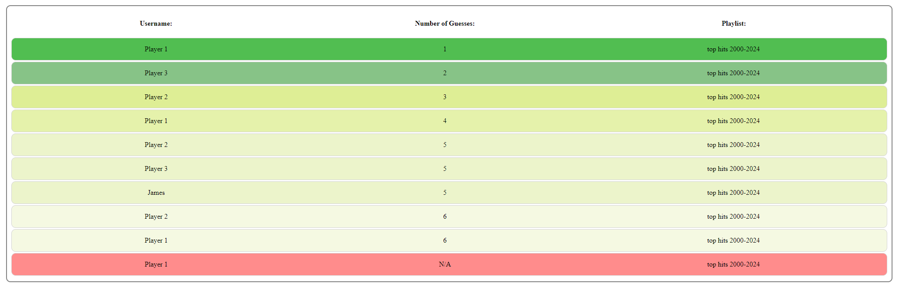

# Instructions to run

1. Download the repository and unzip
2. Open VS code with the corresponding repository
3. run 'npm install' in the VS code integrated terminal/cmd
4. run 'ng serve'
5. Open browser to the given URL (i.e. http://localhost:4200)

# Overview

This is a Song Guessing Game built using an Angular Framework, integrating Spotify API to fetch playlists and song previews

Opening the App will first redirect you to the home page - you will need to select a Spotify Playlist with playable song previews in the Settings Tab before playing.

You can search for playlists using the search bar and the top 5 playlists will be returned

Click the playlist you want and click 'Play Game' to go to game screen

NOTE: 'Play Game' will only work if playlist has enough songs that can be previewed

Click 'Play' to hear snippets of the song and guess the title!

As you guess incorrectly more of the song will unlock and play

After guessing the song correctly or using 6 incorrect guesses, you can save your score by typing your name

Check out your leaderboards showing player name, amount of guesses, and playlist!

